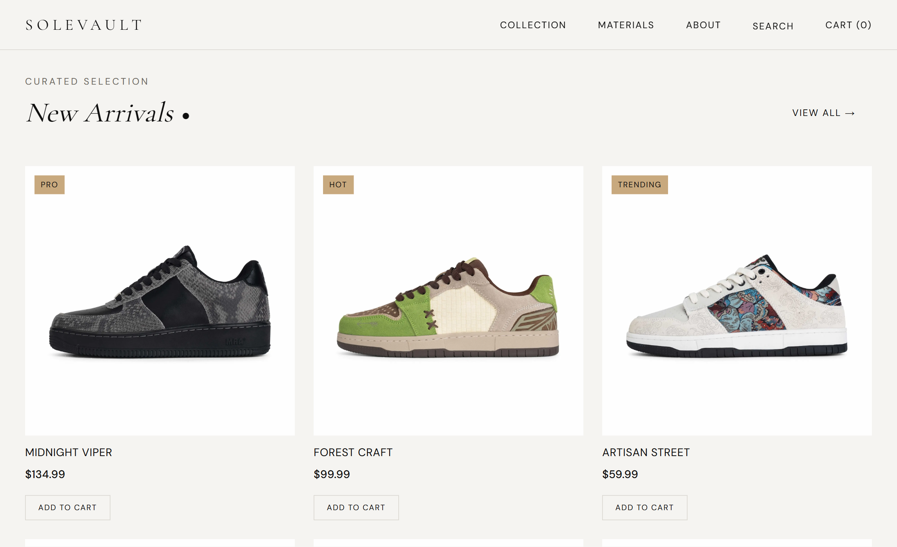

# SoleVault — Premium Footwear E-Commerce

A modern, fully-featured shoe store built with Next.js 14 App Router, Tailwind CSS, Framer Motion, and Stripe payment integration.

---

## Screenshots

<table style="width: 100%; border-collapse: collapse;">
  <tr>
    <td align="center" width="50%">
      
    </td>
    <td align="center" width="50%">
      
    </td>
  </tr>
</table>

---

## Features

| Feature | Description |
|---|---|
| **Hero Slider** | Auto-rotating 4-slide banner with product images, headlines, and CTAs — pauses on hover |
| **Product Grid** | Responsive grid with hover zoom and secondary image swap on every card |
| **Product Detail** | Full-page layout with image gallery, size selector, accordion info panels, and similar products |
| **Shopping Cart** | Real-time cart with quantity grouping, item removal animations, and sticky order summary |
| **Stripe Checkout** | Secure payment via Stripe Elements — coupon code `SOLE10` applies 10% discount |
| **Order Confirmation** | Success page that clears the cart and confirms the order |
| **Toast Notifications** | Slide-in toasts for add/remove cart actions |
| **Custom Cursor** | Animated cursor that adapts color based on background luminance (desktop only) |
| **Page Transitions** | Framer Motion fade-in/out on every route change |
| **Responsive Design** | Fully optimized for desktop, tablet, and mobile |

---

## Tech Stack

- **Framework** — [Next.js 14](https://nextjs.org) (App Router, SSG for product pages)
- **Styling** — [Tailwind CSS 3](https://tailwindcss.com) with CSS custom properties for theming
- **Animations** — [Framer Motion 12](https://www.framer-motion.com)
- **Payments** — [Stripe](https://stripe.com) (Payment Intents + Elements)
- **Language** — TypeScript (strict mode)
- **Fonts** — Cormorant Garamond (display) + DM Sans (body) via Google Fonts

---

## Getting Started

### Prerequisites

- Node.js v18+
- A [Stripe](https://stripe.com) account with test API keys

### Installation

```bash
# 1. Clone the repo
git clone https://github.com/muzamal478/ecommerce-stripe-website.git
cd ecommerce-stripe-website

# 2. Install dependencies
npm install

# 3. Set up environment variables
cp .env.local.example .env.local
```

Edit `.env.local` with your Stripe keys:

```env
NEXT_PUBLIC_STRIPE_PUBLISHABLE_KEY=pk_test_...
STRIPE_SECRET_KEY=sk_test_...
```

### Run

```bash
npm run dev
```

Open [http://localhost:3000](http://localhost:3000) in your browser.

### Test Payment

| Field | Value |
|---|---|
| Card Number | `4242 4242 4242 4242` |
| Expiry | Any future date |
| CVC | Any 3 digits |
| ZIP | Any 5 digits |

Verify payments in the [Stripe Test Dashboard](https://dashboard.stripe.com/test/payments).

---

## Project Structure

```
solevault-shoe-site/
├── app/
│   ├── api/checkout/route.ts     # Stripe Payment Intent endpoint
│   ├── cart/page.tsx             # Shopping cart
│   ├── checkout/page.tsx         # Stripe checkout form
│   ├── product/[id]/             # Dynamic product detail pages (SSG)
│   ├── success/page.tsx          # Order confirmation
│   ├── globals.css               # Design tokens + Tailwind base
│   ├── layout.tsx                # Root layout with providers
│   ├── page.tsx                  # Homepage
│   └── template.tsx              # Page transition wrapper
├── components/
│   ├── ui/                       # Badge, Button, Cursor, Divider, SectionLabel
│   ├── EditorialSplit.tsx         # Brand philosophy section
│   ├── Footer.tsx                 # Footer with newsletter signup
│   ├── HeroSlider.tsx             # Auto-rotating hero banner
│   ├── Navbar.tsx                 # Sticky header with mobile menu
│   ├── ProductCard.tsx            # Product grid card
│   ├── PromoBar.tsx               # Top promotional banner
│   └── Toast.tsx                  # Cart action notifications
├── lib/
│   ├── cart-store.tsx             # Cart context (useReducer + localStorage)
│   └── products.ts                # Product data (10 shoes)
├── types/
│   └── index.ts                   # Product and CartItem types
├── public/images/                 # Product images (20 files)
├── .env.local.example             # Environment variable template
└── legacy/                        # Archived original HTML/CSS/JS version
```

---

## Environment Variables

| Variable | Description |
|---|---|
| `NEXT_PUBLIC_STRIPE_PUBLISHABLE_KEY` | Stripe publishable key (client-side) |
| `STRIPE_SECRET_KEY` | Stripe secret key (server-side only) |

---

## License

This project is licensed under the [MIT License](LICENSE).
